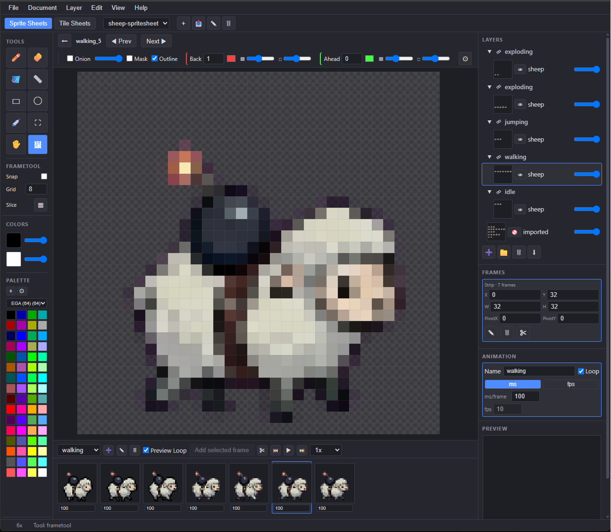

# PixelArtist

Browser-based pixel-art editor for packed sprite sheets and tile sheets.
Frames + animations (an Animations workbench with timeline, pivots, onion
skin and export loop), tiles with live
neighbor preview (3×3/5×5, or 1×1 to turn it off) and drag-to-grow grids,
layers, indexed/system palettes, pixel-snapping PNG import, and
platform-targeted export (GBA, NES, SNES, Game Boy, Game Boy Color,
Commodore 64, generic C header, GIF, Tiled TSX). No dependencies, no
build step.



## Run

ES modules require a static server (file:// will not work):

    ./serve.ps1          # or: python -m http.server 8080

Open the local URL printed by `./serve.ps1`; it chooses an available port
for each run. With the Python command instead, open
[localhost:8080](http://localhost:8080). Use Chrome/Edge for full
file-system support, or any modern browser for the packed `.pixelproj`
download/upload fallback.

## Menu bar

File, Document, Layer, Edit, View, and Help menus sit above the sheet
selector. Every menu item, toolbar button, and keyboard shortcut is a view
over the same action registry, so they never drift out of sync with each
other.

- **File** — New, Open, Save, Save As…, Export Project… (whole project as
  one ZIP or, in Chrome/Edge, straight into a chosen folder — per-sheet
  format selectable)
- **Document** — New Sheet, Import Sheet from Image, Rename Sheet, Delete
  Sheet, Export Sheet (submenu, active sheet), Export Selected Animation
  (submenu, sprite sheets only)
- **Layer** — Add Layer, Add Group, Delete Layer, Merge Down
- **Edit** — Undo, Redo, Cut, Copy, Paste, Project Settings…
- **View** — Show Labels, Show Sequences, Zoom In, Zoom Out, Actual Size
  (100%), Zoom to Fit
- **Help** — Keyboard Shortcuts, About PixelArtist

The top bar still carries its own New/Import/Rename/Delete sheet icon
buttons (wired to the same Document actions) alongside the Sprite Sheets /
Tile Sheets mode tabs.

## Brushes

Brushes are **mask × ink**: the mask decides which pixels a stroke touches,
the ink decides what value is written there. Opacity is dither density, not
transparency, and nothing is ever anti-aliased.

See **[README-BRUSHES.md](README-BRUSHES.md)** for every control in the
Brushes dialog, how to use each ink kind, and the current known gaps.

## Shortcuts

Editor keyboard shortcuts leave focused inputs (including checkboxes),
textareas, contenteditable fields, and controls inside an open dialog
alone, so typing a layer name or a frame's X/Y does not switch tools.
Undo, Redo, and Save also ignore shortcuts whenever any dialog is open;
the focused field or dialog retains its own keyboard behavior.

**Tools**

| Key | Tool |
| --- | --- |
| `B` | Pencil |
| `E` | Eraser |
| `G` | Fill (bucket) |
| `L` | Line |
| `U` | Rectangle |
| `O` | Ellipse |
| `I` | Eyedropper |
| `M` | Select (marquee) — selection only: drag inside moves the rectangle, drag a corner/edge handle resizes it (8 handles); CAD-style dimension lines (arrowed, with value pills) show W×H, origin, and Δ while dragging |
| `V` | Move (✋) — cuts the selection (or whole layer if none) into a floating selection with move/scale/rotate handles; hold `Alt` at drag start to float all layers. On the sheet with no marquee, grabbing a frame starts a translate-only frame-float instead (frame chrome, no handles/rotation; all layers): committing moves the frame rect together with the pixels. Frames pinned by an auto animation don't float. Nothing is rendered to the image until committed |
| `F` | Frame tool (sprite mode only) |
| `T` | Tile tool (tile mode only) |
| `A` | Autotile paint (while a terrain set is being painted) |

**Editing**

| Key | Action |
| --- | --- |
| `Ctrl+Z` | Undo |
| `Ctrl+Y` / `Ctrl+Shift+Z` | Redo |
| `Ctrl+S` | Save (same target as the Save button; opens Save As if the project has no file/folder yet) |
| `[` / `]` | Decrease / increase brush size (pencil & eraser, clamped 1-8) |
| `X` | Swap primary and secondary colors |
| `Delete` | Clear the current marquee selection on the active layer (Select tool), or delete the selected frame (frame tool, sprite mode) |
| `Enter` | Commit the floating selection (render it to the layer(s)); switching tools/sheets/views also commits |
| `Ctrl+X` / `Ctrl+C` / `Ctrl+V` | Cut / copy the marquee selection to the internal clipboard / paste as a new floating selection (`+Alt`: all layers merged). Cut/copy also mirror a flattened PNG to the OS clipboard (paste into Word, an image editor, etc). If the internal clipboard is empty, `Ctrl+V` instead pastes an image from the OS clipboard (e.g. copied in Windows Photos/Snipping Tool) as a new floating selection on the active layer |
| `Escape` | Clear the active marquee selection, or cancel a pending floating selection (restores the cut-out pixels); back out of the frame editor or tile editor to the sheet view |

**Canvas navigation**

| Input | Action |
| --- | --- |
| Mouse wheel | Zoom in/out, centered on the cursor. Stepped table (not continuous multiply): `0.25, 0.5, 0.75, 1, 2, 3, 4, 6, 8, 12, 16, 24, 32, 48, 64` — wheel always moves one table entry at a time, so it never sticks between two adjacent levels. |
| `Space` + drag, or middle-mouse drag | Pan (the transparency checkerboard scrolls with the content, it isn't fixed to the viewport) |

**Resize & scale modifiers**

Frame/tile resize, the selection marquee, and floating-selection scale all
route through the same resize logic:

- `Alt` (held at drag start) resizes from the center instead of the
  opposite corner/edge.
- `Shift` toggles aspect lock. Frame and tile resize only expose corner
  handles, which default to *locked* aspect — so `Shift` there means
  *free* (independent W/H). The marquee and floating-selection scale also
  expose edge handles (N/S/E/W), which default to *free* aspect — so
  `Shift` on an edge handle means *locked* instead.

## Floating selections

The move tool never edits pixels directly. Dragging cuts the selection (or
the whole layer) into a floating selection — outlined with scale handles and
a rotation knob — that hovers over the image. Move, scale, and rotate it
freely (always resampled nearest-neighbor from the original pixels), then
commit with `Enter` (or by switching tool/sheet/view) or cancel with
`Escape`. Every step (float, each transform, commit/cancel, cut, paste) is
individually undoable. In the frame/tile editors, committed pixels are
clipped to the frame/tile rect.

While a float is pending, CAD-style dimension lines (arrowed, with value pills) show its origin and scaled size
(with Δ during a scale drag) and the rotation angle in degrees during a
rotate; the same labels appear on marquee drags and frame create/resize/move.

## Sheets: Import, Rename & Delete

The sheet selector row in the top bar has, besides "+" (New Sheet…):

- **Import…** — creates a new sheet from a PNG image file. The sheet takes
  the file's name (minus extension) and exact pixel dimensions (max
  4096×4096), with the image on its only layer; it lands in the active tab
  (sprite vs tile sheet) and becomes active. One undo step removes it. If
  Pixel Snapper is enabled (see below), the image is snapped before it's
  placed on the layer.
- **✎ (Rename sheet)** — renames the active sheet via a dialog pre-filled
  with the current name. The name feeds the sheet selector and every
  export filename (`<name>.png`, `<name>.frames.json`, `<name>.tiles.json`).
  Empty names are rejected with an alert; renaming is a single undo step.
- **🗑 (Delete sheet)** — removes the active sheet and everything on it
  (layers, frames, animations and, for tile sheets, tiles/terrain sets)
  after a confirm prompt. Also reachable from the Document menu.

## Tile grids

A tile grid (a run of same-size tiles arranged in a rectangle) is created
and resized purely by dragging — there's no "Add Grid" dialog. Selecting a
standalone tile or an existing grid shows 4 short grip strips, one near
the middle of each edge:

- Dragging a grip **outward** on a standalone tile turns it into a new
  grid and grows it by however many whole tile-widths/heights the drag
  covers; dragging outward on an existing grid grows that same axis.
- Dragging a grip **inward** shrinks that axis; shrinking a grid down to
  1×1 collapses it back into a single standalone tile.
- Dragging a grid tile's body (not a grip) always moves the whole grid,
  clamped to the sheet bounds — it never swaps or moves an individual
  tile's content.

## Blob-47 autotile painting

Select a terrain set in the Autotiles panel and choose **Paint terrain** to
mark its whole tilesheet directly, without creating a tile grid. The painter
uses the terrain set's tile size to split the sheet into a neat lattice and
shows a 3×3 guide over each tile: paint the four corners and four side
midpoints to mark terrain, or switch to **Erase** to clear them. Each stroke
is undoable and becomes the matching canonical Blob-47 slot. Hovering a tile
shows a 3×3 result preview with the resolved neighboring artwork, so you can
check the connection before painting further. Below it, a compact 8×6
Blob-47 reference map highlights the exact pattern the tile currently matches.
A red outline means another tile already owns that shape; use the matching
**Use #…** button in the panel to deliberately replace it.

Use **Blob-47 coverage…** for a large, scrollable board: every card shows the
expected reference artwork above your assigned tile, while any unresolved
patterns are marked **MISSING** in red.

## Pixel snapping

Pixel Snapper is a one-shot, import-time conversion, not a live filter: it
runs automatically on Document > Import Sheet from Image and on pasting an
image from the OS clipboard, snapping a hand-drawn or photo-resolution
image down to one pixel per detected cell (k-means color quantization,
then per-axis grid detection and an elastic-walker snap). Configure it in
Project Settings > Import:

- **Pixel snapper** — enable/disable checkbox
- **Palette** — snap into a specific project palette, "(none — full RGB)",
  or the active palette
- **Colors (k)** — quantization budget (default 256)
- **Pixel size** — leave blank to auto-detect the cell size, or force an
  exact size
- **Advanced** (collapsible) — 9 tuning fields (max iterations, peak
  threshold/distance, search window ratio/minimum, strength threshold, min
  cuts per axis, fallback segments, max step ratio), each individually
  resettable to its default

## New Project

File > New opens the New Project dialog (prompts to discard unsaved
changes first if the current project is dirty). It collects the values
stored as the new project's `settings` (see below): sprite sheet
width/height, tile sheet width/height, tile width/height, frame
width/height, and default animation frame duration. These become the
defaults offered by "New Sheet…" and new frames afterward; each field
must be a positive integer or the dialog rejects the input with an alert
instead of silently coercing it.

New Project only sets these; everything else (target platform, pixel
snapper, onion colors, smooth thumbnails) takes its default and is changed
afterward via Edit > Project Settings…, tabbed into General / Import /
Onion Steps.

## Animation panel, onion skin & preview

Below the Frames panel, the **Animation panel** edits the selected
animation: a Name field, a Loop checkbox (whether the *exported* animation
loops — independent of the timeline's own playback-only loop toggle), and
the shared ms/fps base-duration control (toggle between an "ms/frame"
field and an "fps" + "step" pair, e.g. "animate on every 2nd frame at
30fps").

The timeline dock has a drag handle to resize its height (100–400px,
persisted per browser); thumbnail size scales with it. Clicking a cell
scrubs the playhead, selects that frame app-wide, and opens the Frame
Editor on it in one click.

**Onion skin** controls live in the Frame Editor's own toolbar: an enable
checkbox, an opacity slider for the current frame, independent Mask and
Outline toggles, and a Back/Ahead group each with a frame-count (0–8), a
color swatch, and separate mask-/outline-opacity sliders. A ⚙ button opens
Project Settings > Onion Steps for per-distance (1–8 frames back/ahead)
color overrides.

A separate **Preview panel** below the Animation panel mirrors the frame
or tile currently being edited (or the timeline's live playhead frame
while an animation is selected), with its own zoom bar, mouse-wheel zoom,
and drag-to-pan.

## Animations workbench

The **Animations** tab edits the same sprite sheets as Sprite Sheets, but
one animation frame at a time instead of the packed sheet. Switching
between the two tabs keeps the sheet and the selected animation and frame;
**Show on sheet** (above the canvas) and **Edit in Animations** (in the
Sprite Sheets timeline) jump between them.

- **Canvas** — paints the selected frame with every pixel tool, with the
  same onion-skin controls as the Frame Editor. The pivot is drawn as a
  crosshair; turn on **Pivot** and drag on the canvas to move it (snapped
  to half pixels). An auto animation moves the pivot of all its frames
  together.
- **Animations panel** — the list shows each animation's thumbnail
  (bordered in its colour) and an auto/manual badge; rows reorder by
  dragging. Below the list, one row of icon buttons: ➕ **New** (the frame
  is the sheet's sprite size), ⧉ **Duplicate** (auto animations),
  🗑 **Delete** and 📐 **Sprite size** (the size of every frame on the
  sheet, plus a 3×3 anchor for where the existing pixels sit).
- **Animation panel** — the selected animation: name, Loop, **Direction**
  (Forward, Reverse, Ping-pong, Ping-pong reverse), **Colour** (or None),
  base duration, and **Auto-layout** / **Make manual**. Direction drives
  playback, the Preview and GIF / image-sequence exports; ping-pong does
  not repeat its end frames.
- **Timeline** — every animation's frames in sheet order under a lane of
  name tags, with a row per layer (and folder) below. Tags take the
  animation's colour and show its direction (→ ← ⇄ ⇆); click a tag to
  select the animation, double-click to rename it. Each frame number shows
  its duration underneath (`100ms`, or `×2` held frames for an fps-based
  animation). Each cel shows a dot, filled when that layer has pixels in
  that frame; clicking a cel selects its frame and layer, and clicking a
  frame number selects its column. **Shift**+click (or **Shift**+Left/
  Right) extends a range of columns within one animation; Duplicate,
  Delete, Reverse, drags and the duration field then act on the whole
  range. The layer rows replace the Layers panel, which is hidden in this
  tab: they show, rename, lock, add, delete and drag-nest layers and
  folders like the panel does. The column-width slider in the header (or
  **Ctrl**+wheel over the grid) widens the columns; past 40 px each cel
  shows the layer's pixels and a composite row of whole frames appears. A
  🔗 marks a frame used again in the same animation.
  - **New animations** — the **+** at the end of the tag lane (or **New
    Animation** in a frame or tag right-click menu) adds an auto-laid-out
    animation of one blank frame of the sprite size and opens its name for
    editing.
    **New Animation from Frames** (frame right-click menu) turns the
    selected frame or range into a new animation placed right after the
    original, as one undo step. Frames the original still uses elsewhere
    are copied for an auto-laid-out animation and shared by a manual one.
  - **Editing columns** — hover between two frame numbers for a **+** that
    inserts a blank frame there (**Alt**+click: a copy of the frame to its
    left); the **+** after an animation's last number appends. Drag a frame
    number (or the selected range) to move it within its animation;
    **Alt**+drag copies, **Ctrl**+drag inserts a linked use of the frame.
    Drag either end of a tag to resize the animation: inward cuts frames
    off that end, outward adds blank frames there (**Alt** on release: copies
    of the edge frame), as one undo step; Escape cancels. An animation keeps
    at least one frame.
    Double-click a frame number to edit its duration. A manually laid-out
    animation is offered an auto-layout before anything that creates
    frames; declining still allows reordering.
  - **Right-click** a frame number for Duration…, Insert blank / linked
    frame, Duplicate, Unlink (give a linked frame its own pixels),
    Reverse, Delete, New Animation from Frames and New Animation; a cel
    adds **Clear cel** (that layer in that frame); a tag offers Rename,
    Direction, Colour, Loop, New Animation, Duplicate, Auto-layout / Make
    manual and Delete.
  - **Header** — First/Previous/Play/Next/Last, a playback-only Loop
    toggle, **+ Frame**, **Duplicate** and **✕** for the selected columns,
    and their duration (or held frames, for an fps-based animation).
  - **Dock** — drag the bar above the timeline to resize it, or
    double-click it (or focus it and press Enter) to fit the whole
    timeline; again to go back. Arrow keys resize it from the keyboard.
    The size is remembered per workbench.

  Playback shows in the main view and the Preview panel; the view keeps
  its zoom while frames of the same size play. Pressing on the canvas
  while playing stops on the frame shown and selects it for editing.

### Timeline shortcuts

Active in the Animations tab, never while typing in a field or with a
dialog or menu open.

| Keys | Action |
|---|---|
| Enter | Play / stop |
| `,` / `.` | Previous / next frame within the animation (wraps) |
| Alt+N | Duplicate the selected frames after them |
| Alt+B | Insert a blank frame after the selection |
| Alt+M | Insert a linked use after the selection |
| Alt+C | Delete the selected frames (Delete with the timeline focused) |
| Alt+I | Reverse the selected frames |
| Left / Right | Previous / next column (timeline focused); Shift extends the range |

### Layers: drag, solo, paint

Layer rows (the Layers panel and the timeline) and map layers reorder by
dragging: a line shows where the row lands, a folder highlights for a drop
into it, and **Escape** cancels. Drag past the last row to move to the
bottom of the root. **Alt**+click an eye to solo that layer (again to
restore); press an eye or lock and drag across other rows to set them all
the same way, as one undo step. Right-click a row for Rename, Add layer /
group, Merge down and Delete. The animations list and the Sprite Sheets
timeline strip use the same dragging.

## File format

Projects save in one of two layouts, both built from the same
`project.json` + per-layer PNGs:

- **Unpacked folder** (File System Access API, Chrome/Edge only): a
  directory containing
  - `project.json` — sheets, frames, animations, tile metadata, palettes
  - `images/<sheetId>/<layerId>.png` — one PNG per layer, flattened in
    z-order per sheet
- **Packed file** (`.pixelproj`, works everywhere via download/upload): a
  ZIP archive containing the exact same `project.json` +
  `images/<sheetId>/<layerId>.png` entries as the unpacked folder.

`project.json`'s `version` field is checked on load. The current save
format is **version 4**; the loader accepts versions **2, 3 and 4** and
converts older projects to the current in-memory format (see "Older
projects" below). Unsupported or corrupt files produce a clear error (e.g.
`invalid project: unsupported version 99 (expected 4)`) rather than failing
silently. Every accepted version requires a `settings` object with 9
numeric keys (validated on load — any missing or non-numeric key is
rejected):

- `spriteSheetW`, `spriteSheetH` — default sprite sheet dimensions
- `tileSheetW`, `tileSheetH` — default tile sheet dimensions
- `tileW`, `tileH` — default tile size
- `frameW`, `frameH` — default frame size
- `durationMs` — default animation frame duration

Version 4 also requires `sheetMaxWidth` (an integer in 1..4096, set as
"Max layout width" in Project Settings): the width auto-laid-out
animations wrap at. Older files take it from `spriteSheetW`.

### One sprite size per sprite sheet

A sprite sheet is one sprite: its animations are states of the same
sprite, so **every frame on a sprite sheet has the sheet's sprite size**
(`sheet.spriteSize`, saved with the sheet; a new sheet takes the project's
frame size). In Sprite Sheets the frame tool stamps a frame of that size
with a click (the outline follows the pointer) and frames have no resize
handles; the Frames panel's W/H are read-only. **Slice grid** defaults to
the sprite size; slicing at another size needs **Replace existing frames**
(or a sheet without frames), and then the slice size becomes the sprite
size. 📐 **Sprite size** in the Animations panel resizes every frame at once:
auto animations re-pack, other frames grow or shrink in place around the
anchor (refused, naming the frame, if one would leave the sheet or overlap
another).

Projects saved before this are unified on load: a sheet whose frames
differ is re-framed to the smallest size that holds every frame with the
pivots aligned (nothing is cropped), manual animations become auto where
they can, and the sheet is re-packed.

### Animations, pinned frames and locked layers

Every animation is either **auto** or **manual** (`layout: 'auto' |
'manual'`; an auto animation also carries its `cell` size):

- An **auto** animation is laid out by the packer. Each auto animation gets
  one band of rows, in `sheet.animations` order; a band is at most
  `settings.sheetMaxWidth` wide, and the sheet grows downward when it runs
  out of room. Adding, removing or reordering an auto animation's frames
  moves their pixels with them, as one undo step.
- A **manual** animation's frames are free rects you place yourself; it
  references frames without owning their position.

**Auto frames are pinned in Sprite Sheets.** They select and open in the
frame editor, but don't move or resize on the sheet, and their X/Y/W/H
fields in the Frames panel are disabled. **Make manual** (in the timeline)
releases an auto animation's frames without moving a pixel.

**Layers can be locked** (🔒 in the Layers panel, sprite sheets only). A
locked layer still renders but takes no edits: paint tools, fills, floats,
paste and filters skip it. Auto layout refuses to move pixels out of a
locked layer and names the layer in its message. A layer's `locked` flag
round-trips through project.json.

`layout`, `cell` and `locked` are project-internal: neither exported JSON
shape below carries them, and the Frames JSON `animations[]` shape is
unchanged.

### Older projects (versions 2 and 3)

Version 2 and 3 projects convert on load. Accepted strips that are
contiguous, equal-size and equal-pivot become auto animations; every other
animation becomes manual. Animation-owned layer groups become plain groups.
Pixels a strip used to hide go into a hidden `Covered by strips
(converted)` folder, so the sheet looks exactly as it did before.

## Export

**Document > Export Sheet** exports the active sheet as one of: Sheet PNG
(flattened), Frames JSON (sprite sheets), Tiles JSON (tile sheets), Tiled
TSX (tile sheets — terrain-set autotiling data for the Tiled map editor),
or a native binary target: Game Boy Advance, NES, SNES, Game Boy, Game Boy
Color, Commodore 64, or a generic C header.

**Document > Export Selected Animation** (sprite sheets, when an animation
is selected) exports GIF, Spritesheet (PNG + JSON), or Image Sequence
(zipped PNG frames).

**File > Export Project…** exports every sheet in the project at once:
pick a format per sheet, then a destination — a single ZIP download, or
(Chrome/Edge only) write straight into a chosen folder.

### Target-platform compatibility

Project Settings > General > Compatibility sets a **Target platform**
(None, Generic, Game Boy Advance, NES, SNES, Commodore 64, Game Boy, Game
Boy Color, Retro 8/16/32-bit) and an **Export colors** mode (restrict
per-sprite/tile to the hardware limit, or use the full system palette
still capped per sprite/tile). With a platform set, the status bar shows a
live ✓/⚠ compatibility indicator — hover for details, e.g. "Uses 6 colors;
NES allows at most 4 per sprite/tile." — while a frame or tile is open in
its own editor. Exporting to a native binary target re-checks
compatibility and asks for confirmation if there are warnings, or blocks
outright on hard errors.

### Export shapes

Frames JSON and Tiles JSON are the two engine-consumable JSON formats also
reachable via Export Sheet, one per sheet:

**Frames JSON** (sprite sheets only) — `<sheetname>.frames.json`:

```js
{ "sheet": "<name>.png", "width": W, "height": H,
  "frames": [{ "name", "index", "x", "y", "w", "h", "pivotX", "pivotY" }],
  "animations": [{ "name", "loop", "frames": [{ "frame": "<frame name>", "duration": ms }] }] }
```

**Tiles JSON** (tile sheets only) — `<sheetname>.tiles.json`:

```js
{ "sheet": "<name>.png", "count": n,
  "tiles": [{ "index", "name": "<or null>", "x", "y", "w", "h",
    "neighbors": { "n": {"mode","tileIndex","flipH","flipV"}, ... } }] }
// only tiles with a name or stored neighbor preset are listed; tiles can
// have per-tile size (grids + standalone frames coexist on one sheet), so
// there's no sheet-wide tileWidth/tileHeight/columns. A neighbor slot's
// tileIndex is that referenced tile's position in the tiles array.
```

## Test

Requires Node 18+ (uses the built-in `node --test` runner, no dependencies):

    npm test

## License

No license is granted. All rights reserved.
