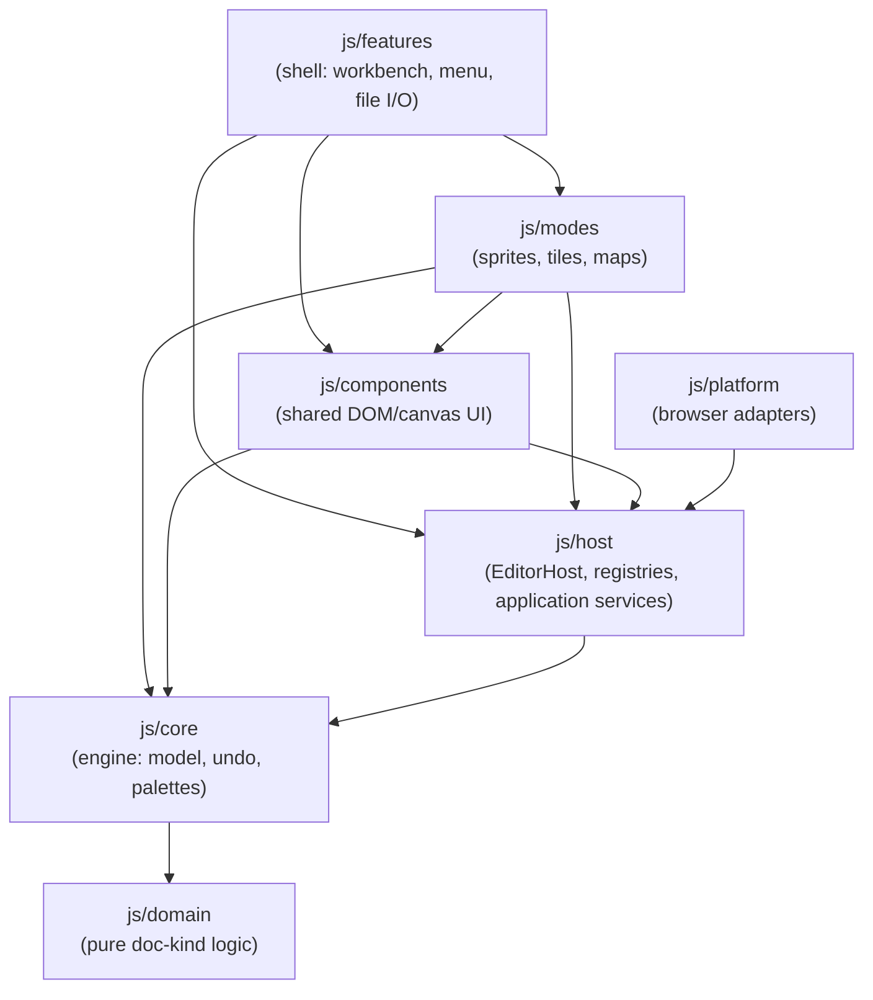
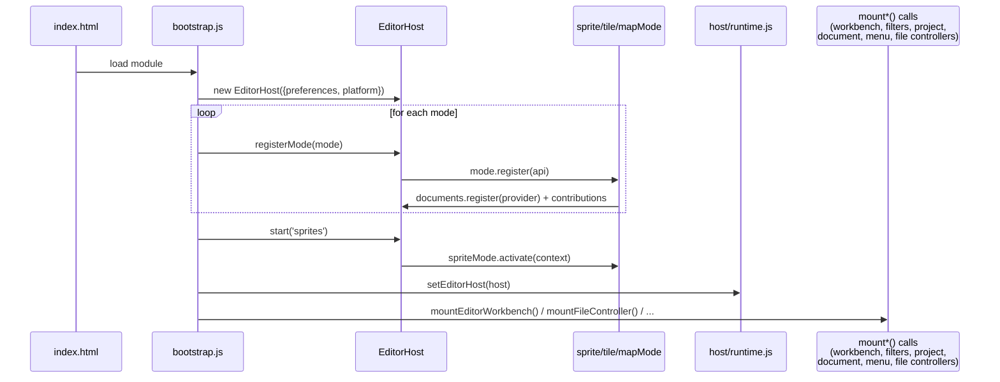
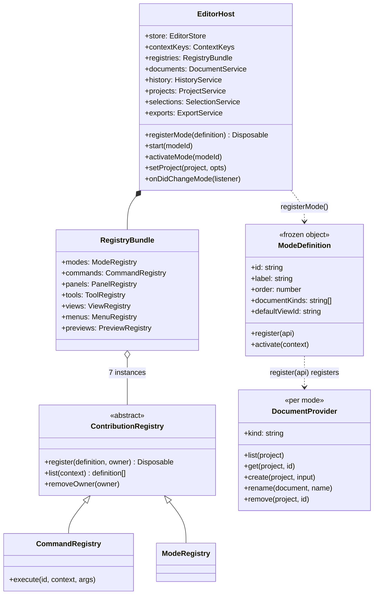
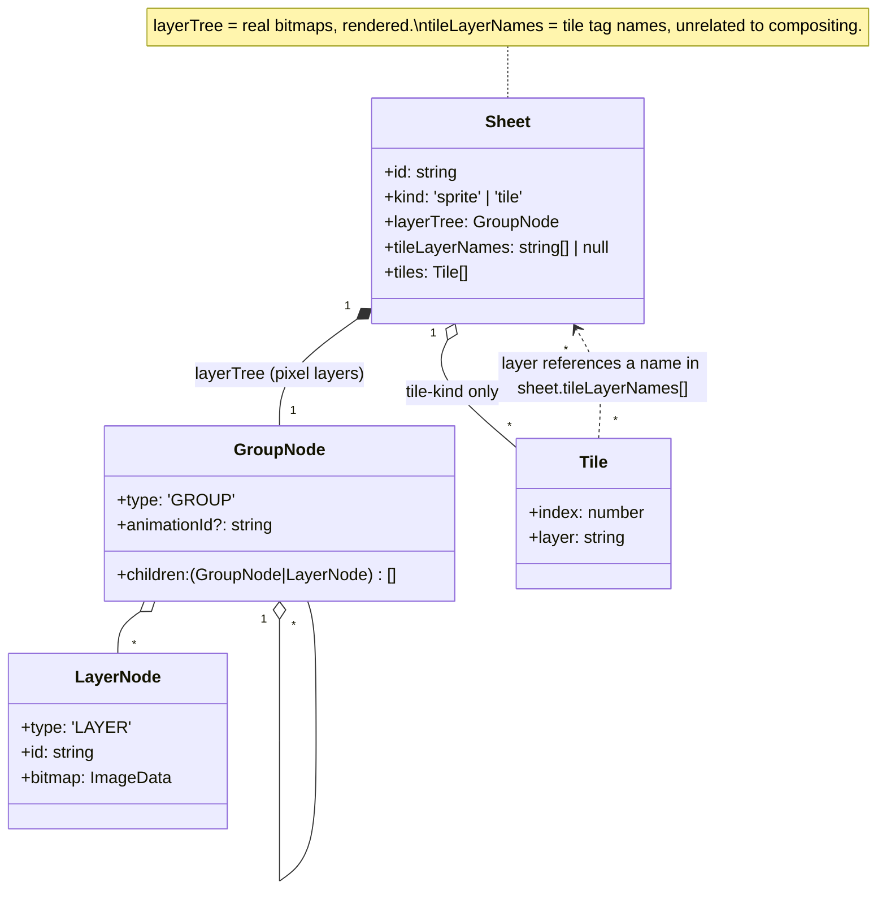

# PixelArtist Architecture

Snapshot after the Phase 5 naming polish. No build step, no
framework — plain ES modules loaded directly by the browser (see
[Build & tooling](#build--tooling)).

This document describes the code as it exists *today*. `EditorHost` and its
services now own application state; the former `js/app` and `js/ui` legacy
layers have been retired.

## Migration status and follow-ups

The architecture migration described in
[`2026-08-08-ddd-target-architecture-design.md`](superpowers/specs/2026-08-08-ddd-target-architecture-design.md)
is complete through Phase 5. Phase 4 retired the legacy architecture in
commit `c41355e`; Phase 5 renamed the tile metadata field without changing
the saved or exported format:

| Phase | Status | Result |
|---|---|---|
| 0 — Foundation | Complete | Application services and state ownership consolidated in `js/host`. |
| 1 — Maps | Complete | Maps is an `EditorStore`-backed mode slice. |
| 2 — Sprites | Complete | Sprites presentation and commands use host services and registries. |
| 3 — Tiles | Complete | Tiles presentation and commands use host services and registries. |
| 4 — Shell + legacy retirement | Complete | `js/app`, `js/ui`, the compatibility event bus, and the host-to-legacy mirror are gone. |
| 5 — Polish | Complete | Renamed the in-memory tile metadata field to `sheet.tileLayerNames`; saved/exported `layers` keys remain unchanged. |

Phase 5 is internal naming cleanup: project files still use version 3 and
the existing `layers` key, while the model uses `tileLayerNames`. Tile exports
also retain `layers` (omitted when empty). The deserializer and validator
continue to support version 2 files and distinguish old flat pixel-layer
payloads from current tile-layer-name metadata: without `layerTree`, `layers`
contains pixel records to migrate into the tree, not tile names.

Before a release, run the automated suite and the owner-operated `[M]` cases in
[`tests/smoke.md`](../tests/smoke.md). Those cases cover native file/folder
pickers and pointer gestures such as frame/strip floating moves, preview
panning, and tile/grid dragging that are intentionally outside automated
browser coverage.

`ExportService` and `ViewManager` are forward-looking scaffolding, not an
unfinished migration phase. Wire or remove them only when a concrete feature
needs those abstractions; current export and view flows do not depend on them.

## Layering

```
js/domain      pure, dependency-free document-kind logic (maps, sprites)
js/core        generic engine: bitmap ops, sheet/layer model, undo stack,
               palettes, autotiling, filters, encoders
js/host        framework: EditorHost, contribution registries, workbench
               primitives, and application services on EditorStore
               (documents, history, selection, project, export)
js/platform    concrete adapters (preferences, file-system, clipboard,
               image-codec) injected into EditorHost
js/modes       one self-contained vertical slice per document kind:
               sprites, tiles, maps
js/features    cross-cutting shell chrome that composes host + modes:
               workbench, menu bar, document tabs, file I/O, filters
js/components  shared DOM/canvas controls and panel primitives
```

`tests/architecture.test.mjs` encodes the intended dependency direction as
executable tests — it is the most authoritative source for these rules and
is worth reading directly. Rules it enforces include: `core` never imports
`components`/`features`/`host`/`platform`/`modes`; `domain` imports nothing outside
itself; no mode imports a sibling mode's files; the shared workbench
(`features/workbench`) never imports concrete mode UI; and per-mode
pointer/geometry controllers never define `mount*Panel(` or import the
panel-UI modules — contributions register independently instead.

Allowed dependency direction (arrows = "imports from"):



`core` and `domain` sit at the bottom and import nothing above themselves
(test-enforced); `host` knows nothing about concrete modes; modes never
import each other.

## Bootstrapping

Entry point: `index.html` loads `<script type="module" src="js/bootstrap.js">`.

`js/bootstrap.js` (~50 lines, capped at 60 by `architecture.test.mjs`) is
the **entire** composition root. It runs, top to bottom:

1. Construct `EditorHost`, whose `HistoryService` owns the application
   `CommandStack`, and inject the browser platform adapters
   (`js/platform/browser/*`).
2. `editorHost.registerMode(spriteMode | tileMode | mapMode)` — each mode's
   `register()` hook fires synchronously, registering its document
   provider and contributions.
3. `editorHost.start('sprites')` activates the sprite mode.
4. `setEditorHost(editorHost)` publishes it through `js/host/runtime.js`'s
   module-level singleton getter so shared components and feature modules can
   reach the one `EditorHost` instance without a DI container.
5. Mounts DOM directly, synchronously, in module-load order (no dynamic
   `import()` — everything below is a plain function call):

```js
const workbench = mountEditorWorkbench();
mountFilterController(workbench);
mountProjectController();
mountDocumentController({ editorHost, workbench });
mountApplicationMenu();
mountFileController();
```

`mountEditorWorkbench()` runs first because it returns the `workbench`
handle the next three mounts need, and because it calls `initFloatSession()`.
`mountFileController()` runs last: its own `boot()` IIFE performs the
project's first `setProject()`, and by then every other mount's store
subscriptions exist to observe it.



## The host — `EditorHost`

`js/host/editor-host.js` is the central object modes and features register
against. It owns:

- `store` — an `EditorStore` (see [State model](#state-model))
- `contextKeys` — a pub-sub map (`modeId`, `documentKind`, `viewId`,
  `toolId`, ...) used to gate panels/menus/commands
- `registries` — frozen object of 7 `ContributionRegistry` subclasses:
  `modes, commands, panels, tools, views, menus, previews`
- `documents/history/projects/selections/exports/focus` — the application
  services (now colocated in `js/host/*`), exposed individually and
  bundled as `services`

Key methods:

- **`registerMode(definition)`** validates via `ModeRegistry`, then calls
  `definition.register(api)`. `api` exposes *owner-scoped*
  `commands/panels/tools/views/menus/previews.register()` (auto-tagged
  `owner: modeId`, so `removeOwner` can retract everything a mode
  contributed in one call) plus `documents.register(provider)`.
- **`start(modeId)` / `activateMode(modeId)`** transactionally updates
  `store.session` and context keys, then synchronously calls
  `mode.activate(context)` (async activation is disallowed — throws).
  Rolls back on error; disposes the previous mode's activation result on
  success; fires `onDidChangeMode`.
- Every `ContributionRegistry` (`js/host/contributions/registry.js`) is
  generic: `register(definition, {owner})` validates `{id, when?}`,
  `list(context)` filters by `when(context)` and sorts by `order` then
  `id`, `removeOwner(owner)` bulk-retracts. `CommandRegistry` adds
  `execute(id, context, args)`; `PreviewRegistry` requires `render()`;
  `MenuRegistry` requires `items`; `ModeRegistry` requires `label`,
  `documentKinds`, `defaultViewId`.

So: modes register contributions once, at `registerMode` time, and get a
fresh activation context each time they become active.



## Modes (`js/modes/`)

Three modes — `sprites` (order 10), `tiles` (order 20), `maps` (order 30) —
each `Object.freeze`d with an identical shape:

```js
export const tileMode = Object.freeze({
  id: 'tiles', label: 'Tile Sheets', order: 20,
  documentKinds: ['tile-sheet'], defaultViewId: 'tiles.sheet',
  register(api) { api.documents.register(tileDocumentProvider); registerTileContributions(api); },
  activate() {},
});
```

Every mode has the same file shape: `index.js` (the definition above),
`documents.js` (a document provider: `{kind, list, get, create, rename,
remove}`), `contributions.js` (registers previews/tools/panels/views),
plus mode-specific controllers.

**Tiles mode** (`js/modes/tiles/`) — this is the mode the autotiles panel
belongs to. It has fully migrated to the Application/Presentation split
(see the Sprites/Maps note below), except for one deliberate exception:
`terrain-preset-art.js` (below), which by design sits outside both layers:

- `contributions.js` registers: a preview provider (`preview.js`); one
  tools contribution whose `createController` wires
  `registerTileTool()`/`registerAutotilePaintTool()` and returns
  `{decorateOverlay}` to layer tile chrome onto the shared canvas; three
  panels gated `when: keys => keys.modeId === 'tiles'` — `tiles.tiles` →
  `#panel-context` (`presentation/tile-panel.js`), `tiles.autotiles` →
  `#panel-autotiles` (`presentation/terrain-set-panel.js`), `tiles.layers` →
  `#panel-tilelayers` (`presentation/tile-layers-panel.js`); two views —
  `tiles.sheet` (shared canvas) and `tiles.tile` (per-tile zoomed editor,
  `presentation/tile-editor-presenter.js`).
- `application/commands/tile-sheet-commands.js` (299 lines) and
  `tile-layer-commands.js` (32 lines) — Command Handlers, resolve their
  sheet by id each call (no captured object references across undo/redo),
  registered by id in `contributions.js`. A test asserts these never touch
  `document/window/alert/confirm/prompt` directly.
- `application/geometry/tile-geometry.js` (79 lines) — pure hit-testing/
  resize math (tile/handle hit-testing, grid bounds, ghost-grid layout) for
  the tile tool, no DOM or state access.
- `presentation/tile-tool-presenter.js` (375 lines) — the tile tool's
  Humble Object: pointer routing and overlay rendering for create/resize/
  move of tiles and grid ownership. Dispatches Commands by id through
  `CommandRegistry`; never imports `application/commands/` directly
  (test-enforced), and never imports the contextual panels or terrain UI
  (also test-enforced).
- `presentation/tile-panel.js` (173 lines), `tile-layers-panel.js`
  (71 lines), `tile-tags-field.js` (69 lines) — panel mount functions for
  the Tiles/Tile-Layers side panels and the shared tag-editing field.
- `presentation/tile-raster-cache.js` (35 lines) — caches a flattened-sheet
  canvas + per-tile thumbnails, invalidated via `invalidateTileRaster()`.
- `application/commands/autotile-paint-commands.js` — Command Handlers
  for the Blob-47 terrain painter: `prepareTerrainPaint`,
  `paintTerrainStroke`, `resolveAutotilePaintConflict`. Resolve-by-id,
  registered by id in `contributions.js`. Wraps `core/terrainsets.js`'s
  pure `assignSlot` directly, via the shared `terrain-slot-snapshot.js`
  helper also used by `terrain-set-commands.js`.
- `application/geometry/autotile-geometry.js` — pure paint-grid/cell/mask
  helpers (`terrainPaintGrid`, `paintTileAt`, `paintCellAt`,
  `strokePaintMask`, `planTerrainPaintCells`, `describeMask`), no DOM or
  state access. `core/blob47.js`'s Blob-47 bitmask/canonicalization
  algorithm itself remains untouched, already pure Domain code.
- `presentation/autotile-paint-presenter.js` — the autotile paint tool's
  Humble Object: pointer/stroke routing, conflict resolution, and all
  Canvas overlay/preview rendering (including the Blob-47 artwork
  reference strip). Dispatches Commands by id; never imports
  `application/commands/` directly (test-enforced).
- `presentation/blob47-coverage-dialog.js` — the standalone Blob-47
  coverage-review `<dialog>`, split out of the painter so the Presenter
  doesn't also own an unrelated `document.createElement` side-panel.
- `application/commands/terrain-set-commands.js` — Command Handlers for
  terrain-set CRUD and slot assignment: `createTerrainSet`,
  `deleteTerrainSet`, `renameTerrainSet`, `assignTerrainSlot`,
  `clearTerrainSlot`, `setTerrainSymmetry`, `applyTerrainLayoutPreset`,
  `setTerrainSetLayer`. Resolve-by-id, registered by id in
  `contributions.js`. Wraps `core/terrainsets.js`'s pure
  `assignSlot`/`applyLayoutPreset` via the shared
  `terrain-slot-snapshot.js` helper below.
- `application/commands/terrain-slot-snapshot.js` — `captureTerrainSlotState`/
  `restoreTerrainSlotState`, shared by `terrain-set-commands.js`,
  `autotile-paint-commands.js`'s `resolveAutotilePaintConflict`, and (since
  3d) `tile-sheet-commands.js`'s `deleteTile`/`deleteGrid`/`resizeGridAxis`.
  Captures every terrain set's `slots` plus every tile's back-reference
  fields (`terrainSetId`/`blobIndex`/`duplicateOf`/`neighbors`) — both
  `assignSlot` and `core/model.js`'s `scrubTileReferences` can mutate a
  terrain set or tile other than the one a caller is directly acting on, so
  the snapshot always covers the whole sheet.
- `application/geometry/terrain-set-geometry.js` — pure view-arrangement
  helpers (`blobStaircaseGroups`, `gridFromRawTemplate`,
  `slotGroupsForViewMode`) for the terrain-set editor's cosmetic slot
  layout, no DOM or state access.
- `presentation/terrain-set-editor.js` — the terrain-set editor's dialogs
  (add-terrain-set, tile-picker) and `renderTerrainSetEditor`, plus the
  Name/Layer/Delete field helpers shared with `tile-panel.js`. Dispatches
  Commands by id; never imports `application/commands/` directly
  (test-enforced).
- `presentation/terrain-set-panel.js` — a thin **panel mount function**:
  builds the tile-picker dialog + editor container, delegates rendering to
  `terrain-set-editor.js`, subscribes to `EditorStore` selectors and history
  to schedule `queueMicrotask`-debounced re-renders, and syncs the selected
  terrain-set id from the active tile's per-document selection.
- `terrain-preset-art.js` — **outside both `application/` and
  `presentation/`**, deliberately. Contains `importPresetArtOntoLayer`,
  which paints a terrain-set preset's reference art onto the active layer
  when a new terrain set is created from that preset. Pushes a raw
  pixel-patch undo entry directly via `core/commands.js`'s `makePixelPatch`
  (the same cross-mode-shared paint-commit idiom
  `js/components/canvas/drawing-engine.js` uses elsewhere), which is exactly why it can't live in
  `presentation/`: `tests/architecture.test.mjs`'s presentation-layer scan
  forbids importing `core/commands.js` from anywhere under `presentation/`.
  This is now an enforced, tracked exception — a dedicated architecture
  test pins the exact set of non-application/presentation mode files
  allowed to import `core/commands.js` to this one file — not an
  accidental layering gap.
- `application/commands/tile-editor-commands.js` — one resolve-by-id
  Command Handler, `setTileNeighborSlot`, for the tile editor's manual
  neighbor-slot dialog. Registered by id in `contributions.js`.
- `application/geometry/tile-editor-geometry.js` — pure offset/hit-testing
  math for the tile editor's neighbor grid (`computeOffset`,
  `mapEditorPoint`, `cellAt`, `insideCenter`, `dirForCell`), no DOM or state
  access.
- `presentation/tile-editor-presenter.js` — the tile editor's Humble
  Object: a second `CanvasView` showing a zoomed, single-tile view with a
  live neighbor preview (redrawn from the same flattened-sheet cache
  pattern as `tile-raster-cache.js`) and the neighbor-slot config dialog.
  Dispatches Commands by id; never imports `application/commands/` directly
  (test-enforced).

**Sprites mode** follows the same Application/Presentation split (see
`js/modes/sprites/application/` and `js/modes/sprites/presentation/`):
`frame-tool-presenter.js` + `frame-chrome-geometry.js`/`frame-geometry.js`/
`frame-pixel-motion.js`/`frame-tool-state.js` (frame/strip tool),
`frames-panel.js`, `timeline-presenter.js` + `timeline-playback.js`
(Timeline dock), `animations-panel.js`, and `frame-editor-presenter.js` +
`onion-skin.js`/`frame-navigation.js` (frame editor + onion skin), backed by
Command Handlers under `application/commands/`. **Maps mode**: `map-editor.js`,
`map-panels.js`.

## Features (`js/features/`)

Orthogonal to modes — one slice per cross-cutting shell concern, not per
document kind. This is what actually mounts DOM at startup (called directly
from `js/bootstrap.js` — see [Bootstrapping](#bootstrapping)):

- `workbench/editor-workbench.js` (289 lines) — builds the shared
  `CanvasView`s, status bar, zoom shortcuts, and **generically iterates
  the host's registries** (`registries.tools.list().map(def =>
  def.createController(...))`, a `PanelManager` reconciling
  `registries.panels` against DOM, `registries.views.list()` populating
  view controllers). Zero mode-specific imports (test-enforced).
- `project/document-controller.js` — mode-tab switching, sheet/map CRUD,
  and undo/redo/cut/copy/paste actions.
- `project/file-controller.js` — open/save/import/export flows and autosave.
- `project/project-controller.js` (443 lines) — project settings, new
  project.
- `shell/menu-controller.js` (93 lines) — builds the `MENUS` array,
  mounts the menu bar.
- `transforms/filter-controller.js` (743 lines) — filter dialogs
  (Chroma Key, Quantize, Checkerboard removal) with live preview.

In short: **modes** = what document kind is being edited plus its
tool/panel/view contributions; **features** = the always-present shell
that composes the host and all registered modes together. Features import
from `js/host`, `js/components`, `js/core`, and `js/platform`; modes stay
self-contained and are driven generically through the registries.

## Commands — `defineAction`

`js/features/shell/actions.js` is a **thin facade over the host's
`CommandRegistry`**, not a separate system:

```js
export function defineAction(id, def) {
  registrations.get(id)?.dispose();               // idempotent redefinition
  const action = { id, label:'', shortcut:null, isEnabled:()=>true, ...def };
  const registration = registry().register({
    ...action,
    when: context => action.isAvailable(context),
    execute: (context, args) => action.run(context, args),
  }, { owner: 'shell-actions' });
}
```

`bindAction(el, id)` wires a toolbar button: click → `runAction(id)`. The
facade subscribes to store, history, and context-key changes to refresh
`hidden`/`disabled`/`checked` state.

`js/components/menubar.js`'s `mountMenuBar(el, menus)` renders a declarative
`MENUS` array (built in `features/shell/menu-controller.js`) whose items
are only `{action: 'id'}` or `{separator: true}` — read exclusively
through `getAction`/`runAction`, silently skipping unknown ids so menus
can be built incrementally. Nested submenus via `action.submenu`
(`items | () => items`, re-evaluated on each open).

Actions are defined near the logic they trigger, all over the codebase —
one `defineAction` call per id, consumed by both a toolbar button
(`bindAction`) and a menu item (`getAction`/`runAction`), so they can never
drift out of sync with each other.

## Rendering & the `layerTree` / `tileLayerNames` split

Core rendering lives in `js/core/model.js` / `js/core/pixels.js`.
`flattenSheet(sheet, floating, overrideLayers)` is the master compositor:
gathers `sheetLayers(sheet)` (walks `layerTree`), excludes layers owned by
an "accepted strip" animation, composites the rest bottom-to-top
(`flattenSheetLayers`), then hard-blits each accepted strip's own layer
group into just its animation frames' rects. `overrideLayers` lets filter
previews and the Preview panel substitute hypothetical bitmaps without
touching real data.

Consumers cache their own flattened canvas, invalidated by store selectors,
`workspace.pixelRevision`, and history subscriptions: `editor-workbench.js`
(main canvas), `modes/tiles/presentation/tile-raster-cache.js` (tile sheet +
thumbnails), and `modes/{sprites,tiles}/preview.js` (Preview panel).

`sheet.layerTree` and `sheet.tileLayerNames` serve separate purposes:

- `sheet.layerTree` — the actual pixel-layer hierarchy (a tree of
  `GROUP`/`LAYER` nodes, a group can own an animation via `animationId`).
  Exists on every sheet. `sheetLayers(sheet) = flattenLayers(sheet.layerTree)`
  is what actually gets rendered.
- `sheet.tileLayerNames` — a flat array of plain strings, tile-only (`null` on
  sprite sheets). Arbitrary "layer name" tags (e.g. "Ground", "Decor")
  used to categorize individual `tile` objects (`tile.layer = name`),
  managed entirely by `application/commands/tile-layer-commands.js` +
  `presentation/tile-layers-panel.js`.
  Has nothing to do with pixel compositing.

Historically, `sheet.layers` held pixels before `layerTree`, then was
repurposed for tile-tag names. Phase 5 removed this runtime naming collision.
The serialized `layers` key remains for compatibility; loading older flat
pixel-layer records never populates `tileLayerNames` with those records.



## State model

`js/host/editor-store.js`'s `EditorStore` is the single application store. It
provides `getState()`, named `transaction()` boundaries, selector-based
`subscribe()`, shared drawing settings, overlay settings, and a monotonic
`workspace.pixelRevision` signal for bitmap mutations. Its state is grouped
as `{project, session, interaction, workspace}`.

`ProjectService`, `DocumentService`, `SelectionService`, and `HistoryService`
own writes in their respective areas. Selections are keyed per document in
`session.selectionsByDocument`; document providers supply `initialSelection`
so activation can atomically seed a valid first layer. Undo/redo runs through
the `CommandStack` owned by `HistoryService`. Floating selection is deliberately
module-owned by `components/canvas/float-session.js` and exposed only through
narrow accessors.

There is no compatibility event bus or host-to-legacy mirror. UI modules
subscribe directly to store selectors, history, or context keys. Bitmap
mutators call `store.notifyPixelsChanged()` so canvas, preview, and panels can
invalidate without replacing large bitmap objects.

Two pieces look scaffolded but not yet wired to a real caller: `ExportService`
(exports currently run through `js/core/export/*` directly) and
`js/host/workbench/view-manager.js`'s `ViewManager` (`editor-workbench.js`
iterates `registries.views.list()` manually instead). Worth treating as
forward-looking placeholders, not active pipelines, if referencing them.

Palettes, project settings, sheets/maps/frames/animations/tiles/terrain
sets all live inline on `store.getState().project.model`, created by `core/model.js`'s
`createProject`/`createSheet`/`createMap` and serialized in the same file
(`serializeGroup`/`deserializeGroup`, with a project-version migration
path from the old flat `layers[]` to `layerTree`).

## UI layer

No component framework — plain DOM manipulation, organized as **mount
functions**: `mountXxxPanel(element)` builds DOM once, wires store/history
subscriptions for reactive re-renders (often microtask-debounced through
`components/panel-mount.js`), and returns `{dispose()}`. Uniform across
`js/components/*.js` and `js/modes/*/*.js`.

The one shared primitive is `js/components/panels/panel-frame.js`'s
`createPanelFrame({id, title, collapsed, onCollapsedChange})` — collapsible
chrome used exclusively by `PanelManager`
(`js/host/workbench/panel-manager.js`) for panels with no fixed
`mountPoint`. `PanelManager.reconcile(context)` diffs
`registries.panels.list(contextKeys)` against currently-mounted panels:
hides/disposes ones no longer wanted, mounts new ones either into a fixed
DOM id (`panel.mountPoint`, e.g. `#panel-context`, `#panel-autotiles`) or
into an auto-generated frame docked into a `[data-workbench-region]`
(`js/host/workbench/layout.js`). Per-panel collapsed/hidden state persists
through the injected `preferences` port.

Menus: `js/components/menubar.js` (see [Commands](#commands--defineaction)).
Dialogs: native `<dialog>` elements in `index.html`, `.showModal()`, with
`js/components/dialogs.js` giving one button Enter-to-submit behavior. Toolbar:
`js/components/tool-palette.js`'s `mountToolPalette`.

`index.html` lays out explicit regions: `#tool-palette` (left),
`#canvas-host` (center), `#side-panels` (right, holds `#panel-layers`,
`#panel-context`, `#panel-animation`, `#panel-autotiles`,
`#panel-tilelayers`, `#panel-preview`, `#panel-map-assets`),
`#timeline-dock` (bottom).

## Build & tooling

No bundler, no TypeScript — plain native ES modules
(`"type": "module"` in `package.json`). `npm test` runs `node --test
tests/*.mjs` (Node's built-in test runner, ~45 files, including the
layering-enforcing `tests/architecture.test.mjs`). `serve.ps1` runs
`npx serve` on an ephemeral port with `Cache-Control: no-store` forced
(`serve.json`) — a dev-run mechanism, not a build step, needed only
because ES modules require an HTTP server (`file://` won't work).

## Extension points

- **New mode**: `js/modes/<name>/{index.js, documents.js,
  contributions.js, ...}` following the shape in
  [Modes](#modes-jsmodes). Register a document provider, register
  contributions via the scoped `api.{commands,panels,tools,views,menus,
  previews}.register(...)` inside `register(api)`, then call
  `editorHost.registerMode(...)` in `js/bootstrap.js`. Must not import
  another mode's files (test-enforced); keep pointer/geometry logic
  separate from panel-mounting code (test-enforced for the existing
  modes).
- **New tool**: a `tools` contribution
  (`{id, label, order, createController(context)}`) in a mode's
  `contributions.js`, whose controller typically calls a
  `registerXTool()` pair and optionally returns `{decorateOverlay()}` to
  hook `canvasView.onOverlay`.
- **New menu command**: `defineAction('namespace.verb', {label, shortcut,
  run(context, args), isEnabled(), isChecked(), isAvailable(),
  submenu})` near the logic it belongs to, then add
  `{action: 'namespace.verb'}` to the relevant menu's `items` in
  `features/shell/menu-controller.js`'s `MENUS`, and/or
  `bindAction(buttonEl, 'namespace.verb')` for a toolbar button.
  `menubar.js` silently skips unregistered ids, so ordering across files
  doesn't matter.
- **New panel**: `api.panels.register({id, title, region, order, when,
  mountPoint?, persistent?, create(element, context)})` inside a mode's
  (or a feature's) contributions — either a fixed DOM id already in
  `index.html`, or an auto-generated `PanelManager`/`createPanelFrame`
  docked into a `data-workbench-region`.
