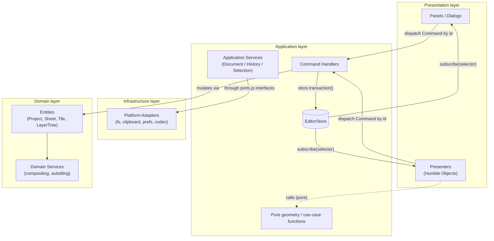
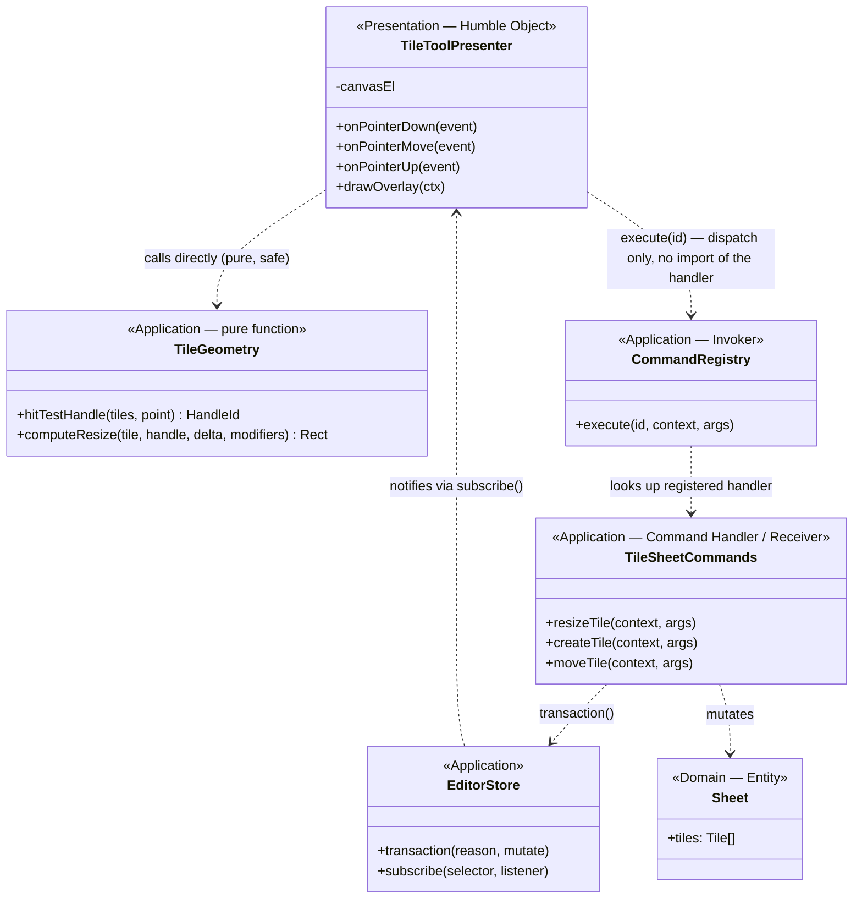
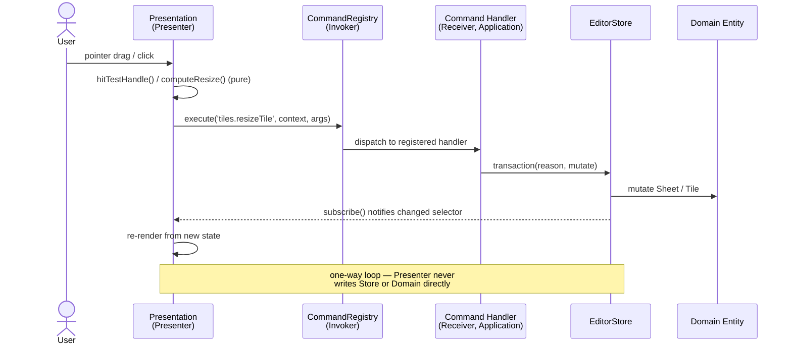

# PixelArtist Target Architecture: Layered (DDD) + Per-Mode Big-Bang Migration

## Status

Supersedes [2026-08-05-extensible-editor-architecture-design.md](2026-08-05-extensible-editor-architecture-design.md).
That spec's host/registries/modes/features shape is kept — most of it is
already built (see [docs/ARCHITECTURE.md](../../ARCHITECTURE.md) for the
current-state snapshot this spec builds on). What changes is the migration
*style*: that spec's step 8 ("remove global-state imports... enforce
dependency boundaries") called for incremental, always-runnable steps with
explicitly "no repository-wide rename or big-bang rewrite." This spec
replaces that with a **big-bang rewrite per mode**, because the driving
goal now is maximally clear separation between rendering, use-case logic,
and domain data — a boundary that's hard to retrofit gradually onto files
that currently mix pointer handling, geometry math, and DOM rendering in
one function.

## Goals

Three roughly-equal pains motivate this, all traceable to the current
mid-migration state (two coexisting state stores, `js/app`/`js/ui` legacy
code still doing most of the work):

1. **State drift risk** — a legacy mutable `state` object and the newer
   `EditorStore` coexist, bridged one-way by
   `legacy-state-adapter.js`. Two sources of truth is a standing risk of
   subtle UI/data desync bugs.
2. **Mental overhead** — understanding any one code path currently means
   knowing which of two state systems it's on, and which of `js/app`,
   `js/ui`, `js/host`, `js/application`, or `js/modes` it lives in.
3. **Extension friction** — adding a mode/tool/panel/command should be
   mechanical; today it still requires touching legacy global state in
   several of the paths.

## Non-goals / constraints

- **No build step, no dependencies, no TypeScript, no UI framework.**
  Plain hand-written ES modules, same as today. This constraint was
  confirmed explicitly and is not up for reconsideration in this spec.
- Not a rewrite of the Domain layer (`js/core`, `js/domain`) — those files
  are already dependency-free and correctly shaped; this spec only
  restructures how the Application and Presentation layers are organized
  and how they communicate.
- Not a redesign of user-facing behavior. Every mode should work
  identically after its migration phase; this is an internal
  restructuring, not a feature change.

## Target architecture

### Layering (Domain-Driven Design, four layers)

| DDD layer | Maps to | Responsibility |
|---|---|---|
| **Domain** | `js/domain`, `js/core` | Entities (`Project`, `Sheet`, `LayerTree`, `Tile`, `Palette`) and domain services (compositing, autotiling math, serialization). No I/O, no framework awareness. Unchanged by this migration. |
| **Application** | `js/host` (absorbing today's `js/application`) plus each mode's `application/` folder | Use-case orchestration: Command Handlers (Gang-of-Four **Command pattern** — already correctly used for undo/redo via `CommandRegistry`/`CommandStack`), document/history/selection services, and `EditorStore` (the state container Presentation subscribes to). |
| **Infrastructure** | `js/platform` | Adapters implementing the interfaces the Application layer declares (`js/host`'s `ports.js`) — file system, clipboard, prefs, image codec. Textbook **Ports & Adapters (Hexagonal Architecture)**; the existing `ports.js` naming already signals this intent. Unchanged by this migration. |
| **Presentation** | Each mode's `presentation/` folder, `js/features`, `js/components` | Panels, canvas rendering, dialogs. Reads `EditorStore`, dispatches Commands by id. Never mutates a Domain entity or constructs an undo entry directly. |

Two supporting patterns govern how Presentation and Application talk to
each other:

- **Unidirectional, Flux-style data flow.** Presentation dispatches a
  Command → Application mutates `EditorStore` via
  `store.transaction(reason, mutate)` → Presentation re-renders via
  `store.subscribe(selector, listener)`. No two-way binding; no
  Presentation code writes state fields directly.
- **Presenters as Humble Objects.** Every mode's pointer/canvas controller
  (today's `tile-editor-controller.js`, `sprite-sheet-controller.js`,
  etc., which mix pointer binding, hit-testing math, and drawing) splits
  into: a pure Application-layer function for the math (hit-testing,
  resize math — takes plain data, returns plain data, unit-testable with
  zero DOM), and a deliberately "humble" Presenter that only binds real
  events, calls the pure function, calls a Command, and draws — no
  decision-making of its own.

The existing host + 7 `ContributionRegistry` subclasses (`modes, commands,
panels, tools, views, menus, previews`) is already an instance of the
**Plugin/Extension-point architecture** used by VS Code and Eclipse —
modes register contributions against a neutral host rather than the host
knowing about them. This part is sound and unchanged.



### Per-mode file layout

Applied to `js/modes/tiles/` — the largest, most tangled mode today — as
the concrete template every mode follows:

```
js/modes/tiles/
  index.js                       — mode definition (contract with the host)
  application/
    documents.js                 — document provider (use-case: list/get/create/rename/remove)
    commands/
      tile-sheet-commands.js     — Command Handlers: create/resize/move/delete tiles
      terrain-set-commands.js    — Command Handlers: terrain-set CRUD
      tile-layer-commands.js     — Command Handlers: tile-tag layer CRUD
    geometry/
      tile-geometry.js           — pure: hitTestHandle(), computeResize()
      autotile-geometry.js       — pure: Blob-47 pattern matching
      terrain-layout.js          — pure: slot/layout math for terrain-set editor
  presentation/
    tile-tool-presenter.js       — Humble Object: binds pointer events, calls geometry + dispatches commands, draws overlay
    autotile-paint-presenter.js
    terrain-set-presenter.js     — dialog UI; delegates all decisions to terrain-layout.js
    tile-panel.js
    tile-layers-panel.js
    autotiles-panel.js
    tile-raster-cache.js         — OffscreenCanvas thumbnail caching (Canvas API use => Presentation, not Application)
  contributions.js                — registers application + presentation into the host's registries
```

Sprites and maps follow the same `application/` + `presentation/` +
`contributions.js` + `index.js` shape at whatever size fits their scope.

The class shape for the tile tool specifically — the clearest example of
the Presenter/Humble-Object split, since today's `tile-editor-controller.js`
mixes all of these concerns in one file:



Note the asymmetry: the Presenter is allowed to call `TileGeometry`
directly (it's pure, side-effect-free, safe to import), but must reach
`TileSheetCommands` only through `CommandRegistry.execute(id, ...)` — it
never imports the handler module itself. That's rule 3 from the
enforcement section below, made concrete.

### Enforcement (mechanical, not aspirational)

Extends the existing `tests/architecture.test.mjs` pattern — which
already bans `document`/`window`/`alert`/`confirm`/`prompt` from the tile
command files — to the whole codebase:

1. **Domain never imports upward.** Already enforced; unchanged.
2. **Application never touches rendering.** A banned-globals scan
   (`document`, `window`, `alert`, `confirm`, `prompt`,
   `CanvasRenderingContext2D`, `OffscreenCanvas`, `getContext`) over every
   `application/` folder and `js/host`.
3. **Presentation dispatches Commands only by id, never by import.**
   Presentation files may not import anything under a mode's
   `application/commands/` or `js/core/commands.js` directly; they call
   `runAction(id)` / `host.commands.execute(id, ...)`. This generalizes
   the Command pattern's Invoker/Receiver decoupling that `defineAction`/
   `runAction` already implements today.
4. **No mode imports another mode's `application/` or `presentation/`.**
   Already enforced; unchanged.

### Data flow: retiring the dual state store

Today, Command Handlers mutate a legacy `state.project` object and
`legacy-state-adapter.js` mirrors it into `EditorStore` afterward. The
target: Command Handlers mutate the `Project` entity **inside**
`EditorStore` directly via a transaction, and `EditorStore` becomes the
only place project state lives. `HistoryService`'s undo stack
(`CommandStack`) is unchanged internally — Command Handlers reach it
through injected Application-layer services instead of a global import on
`js/app/state.js`.

Because `js/features` (shell chrome: document tabs, menu bar, file I/O,
filters) currently orchestrates mode switching and CRUD through the
legacy state/event system, the shell can't fully drop the legacy bridge
until all three modes are migrated off it — so the shell gets its own
phase (4, below) after the three modes.

The target request/response shape for any user action, end to end —
Command pattern (Invoker/Receiver) nested inside a Flux-style
unidirectional loop:



## Migration plan

Three big-bang mode rewrites, staged so the app stays runnable between
phases, plus a foundation phase and a shell phase:

| Phase | Scope | Why this order |
|---|---|---|
| **0 — Foundation** | Merge `js/application` → `js/host`; add the store-write transaction path for Command Handlers; land the layer-boundary tests described above. No behavior change. | Nothing to migrate onto without this scaffolding first. |
| **1 — Maps mode** | `map-editor.js`, `map-panels.js`, `documents.js`, `contributions.js`, `preview.js` (~5 files) rewritten fully onto Application/Presentation, `EditorStore`-only. | Smallest, least entangled with shared `js/ui` — proves the pattern on real code at low risk before committing to it everywhere. |
| **2 — Sprites mode** | `sprite-sheet-controller.js`, `frame-panel.js`, plus absorbing `js/ui`'s `animpanel.js`/`timeline.js`/`frameeditor.js` into `modes/sprites/presentation/`. | Larger, more entangled (timeline scrubbing, onion skin), but self-contained relative to tiles. |
| **3 — Tiles mode** | Full split per the layout above: `tile-editor-controller.js`, `autotile-paint-controller.js`, `terrain-set-controller.js`, panels, commands, `tile-raster-service.js`, plus absorbing `ui/tileeditor.js`. | Largest and most intricate (Blob-47 matching, terrain sets) — done last, once the pattern is proven twice already. |
| **4 — Shell/features + retire legacy** | Rewrite `document-controller.js`, `file-controller.js`, `project-controller.js`, `menu-controller.js`, `filter-controller.js` off legacy `state`/`on()`; delete `legacy-state-adapter.js`, `js/app`, `js/ui` once nothing references them. | Can't fully drop the legacy bridge until all three modes are off it. Highest-risk phase — touches everything. |
| **5 — Polish (optional)** | Rename `sheet.layers` → e.g. `sheet.tileLayerNames` to remove the naming collision with `sheet.layerTree` (documented in [docs/ARCHITECTURE.md](../../ARCHITECTURE.md)). | Small, mechanical, does not block anything above. |

Each phase ends with the app fully working (other not-yet-migrated modes
continue on the legacy bridge until their own phase) and is a natural
commit + `/compact` boundary.

## Effort estimate (tokens)

Rough order-of-magnitude, since I (Claude) am the one implementing this —
not calendar time, and not a commitment:

| Phase | Estimate |
|---|---|
| 0 — Foundation | 150K–300K |
| 1 — Maps | 150K–300K |
| 2 — Sprites | 300K–600K |
| 3 — Tiles | 500K–900K |
| 4 — Shell + retire legacy | 400K–700K |
| 5 — Polish | 50K–100K |
| **Total** | **~1.5M–2.9M tokens** |

The dominant source of variance is phases 3 and 4: there is no automated
coverage for pointer/canvas interactions (drags are verified manually by
design, not via simulated Playwright drags), so correctness there depends
on manual verification and iteration on feedback — that iteration is what
could push toward the high end of each range.

## Testing

- Layer-boundary tests (banned-globals scan for Application, import-path
  restriction for Presentation → Commands) land in phase 0 and apply to
  every phase after.
- Pure Application-layer functions (geometry, hit-testing, resize math)
  become directly unit-testable with `node --test`, since they take and
  return plain data with no DOM dependency — this is new test coverage
  the current codebase doesn't have.
- Presenters (DOM-facing) are not unit-tested; verified manually per your
  existing workflow (drag interactions are checked by hand, not
  simulated).
- Existing `tests/*.mjs` domain/core tests are unaffected — this
  migration doesn't touch `js/core`/`js/domain`.
- `project.json` save/load round-trips must keep passing unchanged at
  every phase boundary — no version bump, no format change.

## Rejected alternatives

- **Approach A — finish the 2026-08-05 spec's incremental migration.**
  Lower token cost and lower per-commit risk (every commit stays small
  and safe), but doesn't produce as clean a Presentation/Application
  boundary — retrofitting a pure-function split onto files gradually,
  commit by commit, tends to leave partial splits in place indefinitely.
  Rejected because the explicit goal here is maximal clarity of the
  boundary, not minimal risk per commit.
- **Approach C — stop migrating, formalize the dual-store bridge as
  permanent.** Cheapest, but leaves all three stated pains
  (state drift, mental overhead, extension friction) unaddressed.
  Rejected.
