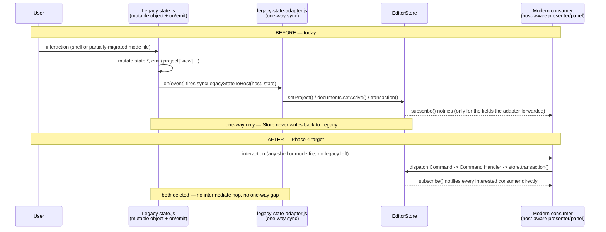
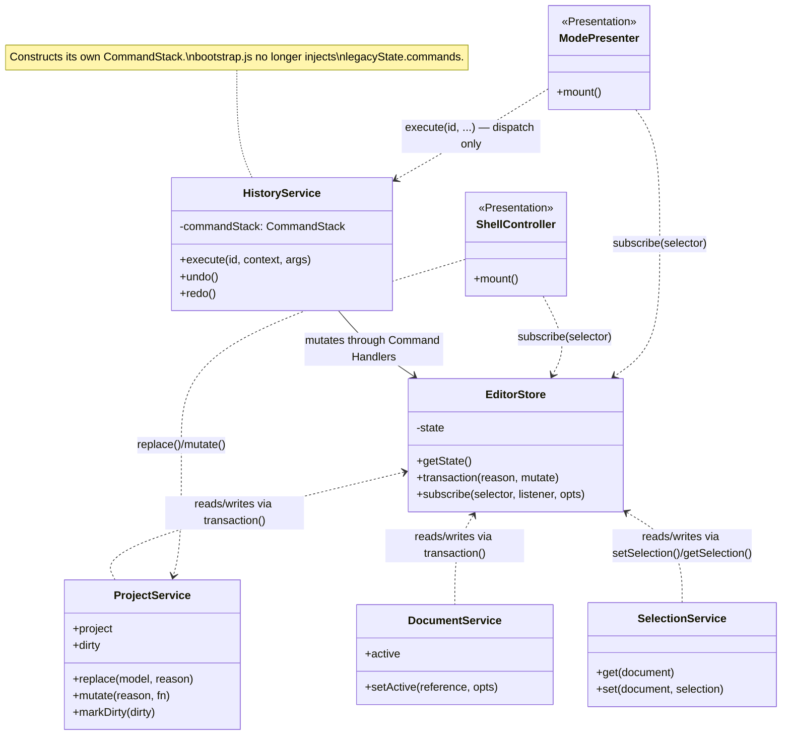
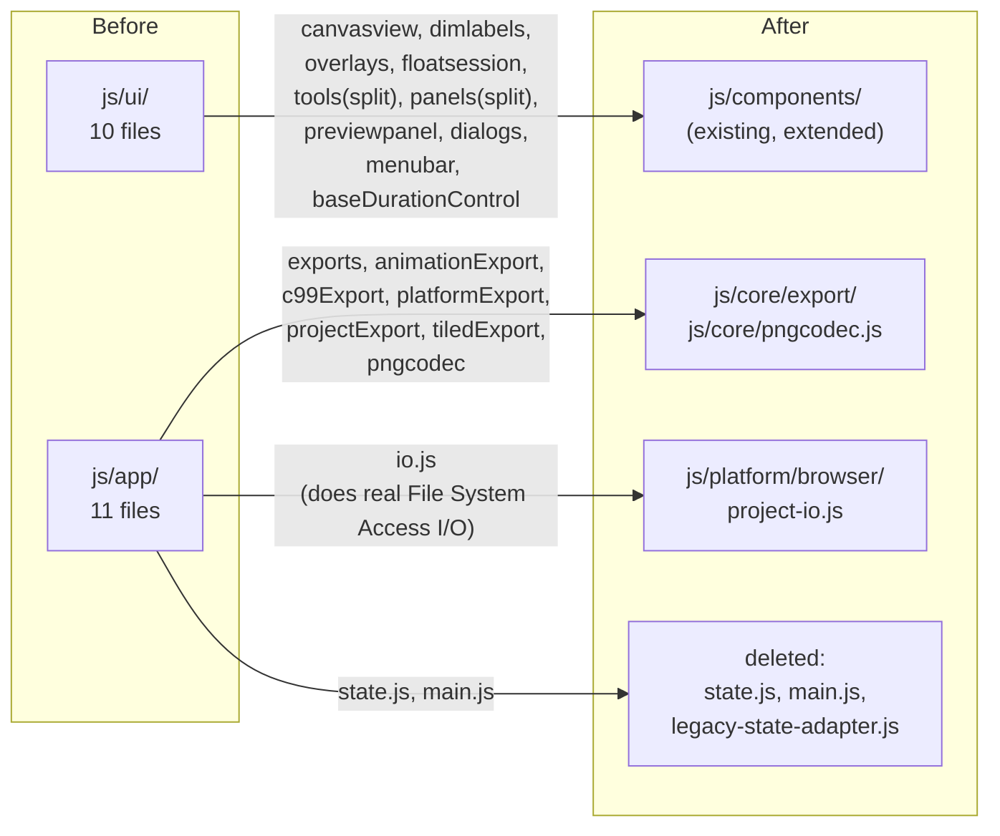
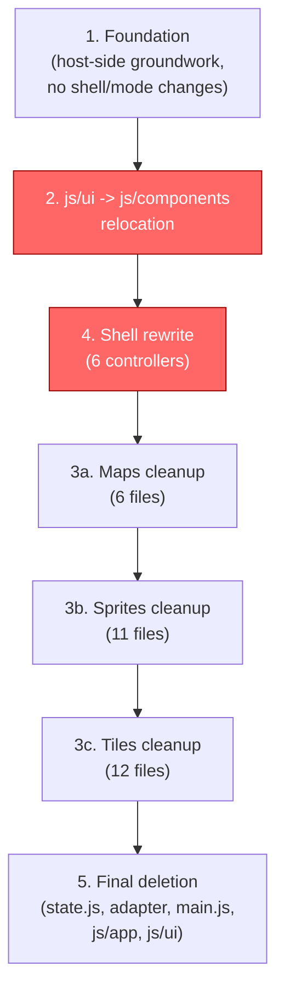

# Phase 4: Shell + Legacy State Retirement — Design

## Status

Implements Phase 4 of the migration roadmap in
[2026-08-08-ddd-target-architecture-design.md](2026-08-08-ddd-target-architecture-design.md).
Phases 0 (foundation), 1 (maps), 2 (sprites), and 3 (tiles, sub-phases
3a-3d) are complete — HEAD `ffb5232` at the start of this phase.

## Goal

Retire the legacy `js/app/state.js` mutable-object + `on()`/`emit()`
event-bus system entirely. `EditorStore` becomes the sole owner of
project/session identity; every consumer — the 6 shell controllers under
`js/features`, and the ~29 files across maps/sprites/tiles that still
import `state.js` despite those modes being nominally "done" — moves onto
`EditorStore.subscribe()` and host services. `js/app/state.js`,
`legacy-state-adapter.js`, and `js/app/main.js` are deleted. `js/ui`'s 10
shared Presentation widgets relocate into the existing `js/components/`
library. `js/app`'s 8 state-free utility/codec files relocate by DDD
layer.

## Scope correction vs. the original roadmap

The roadmap's Phase-1/2/3 rows implicitly assumed the three modes were
already `EditorStore`-only, leaving Phase 4 as "just" the 5 named shell
controllers. A scoping survey (2026-08-10) found this untrue: 29 of 61
mode files still import `js/app/state.js` directly — including maps'
top-level `contributions.js` — and `EditorStore.project.model` is
currently only a pointer aliasing the same object `state.project`
references, kept in sync one-way by `legacy-state-adapter.js`, not a true
sole owner. This design's scope therefore covers both the shell rewrite
and finishing the mode cleanup the earlier phases left behind, plus a
6th shell file (`editor-workbench.js`) the roadmap's phase table omitted.

## Non-goals

- No user-facing behavior change — every mode must work identically
  after this phase, same as prior phases.
- Not a rewrite of `js/core`/`js/domain` (Domain layer, unaffected
  beyond receiving the relocated files described below).
- Phase 5's `sheet.layers` → `sheet.tileLayerNames` rename stays a
  separate, later, unblocked piece of work.
- `project.json` save/load format is unaffected — no version bump.

---

## Current state (as of 2026-08-10, HEAD `ffb5232`)

This section documents the exact as-is mechanics the rest of this design
replaces — pulled from source, not summarized from memory, so the plan
that follows this design can cite it directly.

### `EditorStore`'s actual current shape and API

`js/host/editor-store.js`:

```js
function createEditorState(initial = {}) {
  return {
    project: { model: null, dirty: false, ...initial.project },
    session: {
      activeModeId: null, activeDocument: null, activeDocumentByMode: {},
      activeViewId: null, activeToolId: null, selectionsByDocument: {},
      ...initial.session,
    },
    interaction: { ...initial.interaction },
    workspace: { focusedSurfaceId: null, ...initial.workspace },
  };
}
```

API surface: `getState()` (returns the live mutable state, no
cloning/freezing), `transaction(reason, mutate)` (reentrant,
depth-counted, batches notification to one flush per outermost
transaction), `setProject(model, {dirty, reason})`, `markDirty(dirty)`,
`updateSession(patch, reason)` (shallow `Object.assign` into
`session`), `setSelection(document, selection)`, `getSelection(document)`,
`subscribe(selector, listener, {equals, signal, fireImmediately})`.

**Sharp edge that matters for the Foundation group:** `setSelection`
*replaces* the entire per-document selection object
(`state.session.selectionsByDocument[key] = {...(selection ?? {})}`) —
it does not merge. Any command handler or presenter that starts writing
`selectedTileId`/`selectedTerrainSetId`/`editingFrameId`/`editingTileId`
into this map must read-modify-write (spread the existing entry first),
or it will silently clobber the `layerId`/`frameId`/`animationId` fields
`SelectionService` already owns there. `legacy-state-adapter.js` (below)
already does this correctly today — its pattern is the one to carry
forward, not `setSelection`'s own replace-only default.

### `legacy-state-adapter.js` — the one-way sync it performs

`js/features/project/legacy-state-adapter.js` (54 lines) — condensed
below to its control flow and exact semantics; branch bodies are
described in comments rather than transcribed verbatim, since the
literal per-mode branching is not itself load-bearing for this design:

```js
export function syncLegacyStateToHost(host, legacyState) {
  if (!host) return;
  const modeId = legacyState.mode;
  if (host.activeModeId !== modeId && host.registries.modes.get(modeId)) host.activateMode(modeId);
  if (host.store.getState().project.model !== legacyState.project ||
      host.store.getState().project.dirty !== !!legacyState.dirty) {
    host.store.setProject(legacyState.project, { dirty: !!legacyState.dirty, reason: 'legacy-project' });
  }
  const reference = modeId === 'maps'
    ? (legacyState.activeMapId ? { kind: 'map', id: legacyState.activeMapId } : null)
    : (legacyState.activeSheetId ? { kind: modeId === 'sprites' ? 'sprite-sheet' : 'tile-sheet', id: legacyState.activeSheetId } : null);
  host.documents.setActive(reference, { modeId, allowMissing: true });
  host.store.transaction('legacy-session', state => {
    state.session.activeViewId = /* mapped from legacyState.view */ ...;
    state.session.activeToolId = legacyState.tool;
    if (reference && modeId === 'maps') {
      // first-seen-only seed of layerId/mapItemId — SelectionService owns
      // writes after that; an unconditional overwrite would clobber them.
    } else if (reference) {
      // layerId/frameId/animationId: first-seen-only seed, same reason.
      // tileId/terrainSetId: refreshed UNCONDITIONALLY every sync, since
      // those two fields are still legacy-owned (state.selectedTileId /
      // state.selectedTerrainSetId), not yet SelectionService-authoritative.
    }
  });
  host.contextKeys.update({ modeId, documentKind: reference?.kind,
    viewId: host.store.getState().session.activeViewId, toolId: legacyState.tool,
    hasDocument: !!reference });
}
```

Four things flow one-way, legacy → host, every time it runs: (1) active
mode, via `host.activateMode()`; (2) the project model pointer + dirty
flag; (3) the active document reference, via `host.documents.setActive()`;
(4) `contextKeys` (used for command `when` clauses). Nothing flows
host → legacy — this works today only because the fields Command
Handlers already write through the store (`selectionsByDocument`'s
`layerId`/`frameId`/`animationId`/`mapItemId`) are fields `state.js`'s
own `activeLayer()`/`currentContextLayers()` helpers already read via
`getEditorHost().selections.get(...)` instead of `state.*` when a host
exists — the split is bridged in that direction inside the domain-helper
layer, not this adapter.

**Trigger:** wired reactively inside `document-controller.js`
(`js/features/project/document-controller.js:91-97`):

```js
const syncEditorHost = () => syncLegacyStateToHost(editorHost, state);
on('project', syncEditorHost);
on('view', syncEditorHost);
on('selection', syncEditorHost);
on('tool', syncEditorHost);
on('history', syncEditorHost);
syncEditorHost();
```

Not scheduled or polled — it fires synchronously inside the legacy event
bus's `emit()` dispatch. The whole mechanism disappears the moment
`document-controller.js` stops emitting/listening on these five legacy
events, which is exactly what the Shell rewrite group does — but that
means the Shell group must have a replacement trigger in place for all
four things this adapter currently drives *before* it can be deleted.

### Bootstrap / import graph, current

Actual entry point is `js/bootstrap.js` (loaded from `index.html`'s only
`<script type="module">` tag) — **not** `js/app/main.js`, which is a
lazily dynamic-imported sub-step:

```js
// js/bootstrap.js
import { EditorHost } from './host/editor-host.js';
import { state as legacyState } from './app/state.js';
// ...platform adapters, 3 modes...

export const editorHost = new EditorHost({
  historyStack: legacyState.commands,   // <- CommandStack comes FROM state.js
  preferences: new BrowserPreferences(),
  platform: { files: new BrowserFileSystem(), autosave: new BrowserAutosave(),
              clipboard: new BrowserClipboard(), imageCodec: new BrowserImageCodec() },
});
editorHost.registerMode(spriteMode);
editorHost.registerMode(tileMode);
editorHost.registerMode(mapMode);
editorHost.start('sprites');
setEditorHost(editorHost);

import('./app/main.js');   // "compatibility composition root", per its own comment
```

```js
// js/app/main.js — the whole file
const editorHost = getEditorHost();
const workbench = mountEditorWorkbench();          // features/workbench
mountFilterController(workbench);                  // features/transforms
mountProjectController();                           // features/project
mountDocumentController({ editorHost, workbench }); // features/project
mountApplicationMenu();                              // features/shell
mountFileController();                               // features/project
```

`EditorHost` and all 3 modes are fully constructed and activated *before*
`state.js`'s module singleton does anything beyond supplying the initial
`CommandStack` — mode registration doesn't depend on the shell being
mounted. `tests/architecture.test.mjs` already caps `main.js` at ≤30
lines, and its own comment ("prevents new code from importing the legacy
root") signals the intended end-state: `bootstrap.js` absorbs the 6
`mount*` calls directly and `main.js`/the dynamic-import indirection is
deleted outright.

### Full list of currently-legacy-coupled files

**Mode files importing `js/app/state.js`** (29 total):

| Mode | Files |
|---|---|
| maps (6) | `contributions.js`, `application/commands/map-paint-commands.js`, `presentation/map-assets-panel.js`, `presentation/map-panel.js`, `presentation/map-tool-presenter.js`, `preview.js` |
| sprites (11) | `application/commands/animation-commands.js`, `application/commands/animation-lifecycle-commands.js`, `application/commands/frame-commands.js`, `application/commands/strip-commands.js`, `presentation/animations-panel.js`, `presentation/frame-editor-presenter.js`, `presentation/frame-tool-presenter.js`, `presentation/frames-panel.js`, `presentation/slice-grid-dialog.js`, `presentation/timeline-presenter.js`, `preview.js` |
| tiles (12) | `application/commands/tile-sheet-commands.js`, `presentation/autotile-paint-presenter.js`, `presentation/terrain-set-editor.js`, `presentation/terrain-set-panel.js`, `presentation/tile-editor-presenter.js`, `presentation/tile-layers-panel.js`, `presentation/tile-panel.js`, `presentation/tile-raster-cache.js`, `presentation/tile-tags-field.js`, `presentation/tile-tool-presenter.js`, `preview.js`, `terrain-preset-art.js` |

**Files importing `js/ui/*`** (16, shell + modes):

Shell (6): `document-controller.js`, `file-controller.js`,
`project-controller.js`, `filter-controller.js`, `menu-controller.js`,
`editor-workbench.js`.
Modes (10): `maps/presentation/map-tool-presenter.js`;
`sprites/presentation/{animations-panel,frame-editor-presenter,
frame-overlay-renderer,frame-tool-presenter,slice-grid-dialog,
timeline-presenter}.js`; `tiles/presentation/{autotile-paint-presenter,
terrain-set-editor,tile-editor-presenter,tile-tool-presenter}.js`.

Note some files appear in both lists (e.g. `frame-editor-presenter.js`,
`tile-tool-presenter.js`) — they need both kinds of cleanup.

---

## Target architecture

### Diagram: data flow, before vs. after



### Diagram: target class shape



### State field mapping

| Current `state.js` field/helper | Destination |
|---|---|
| `project` | `EditorStore.project.model`, sole-owned (no more shared pointer) |
| `dirty` | `EditorStore.project.dirty` (already exists; store becomes sole owner) |
| `mode` | `EditorStore.session.activeModeId` (already exists) |
| `view` | `EditorStore.session.activeViewId` (already exists) |
| `activeSheetId` / `activeMapId` | Derived from `host.documents.active` |
| `activeLayerId` | Dropped — production already reads `host.selections`; this was a test-only fallback |
| `tool` | `EditorStore.session.activeToolId` (already exists) |
| `selectedTileId`, `selectedTerrainSetId`, `editingFrameId`, `editingTileId` | `EditorStore.session.selectionsByDocument` via `SelectionService` — extends the mechanism that already covers layer/frame/animation selection; writers must read-modify-write (see the `setSelection` sharp edge above) |
| `onion` | No new home needed — already an alias into `project.settings.onion`; consumers redirect to read `host.projects.project.settings.onion` directly |
| `maybeSnapPixels()` | Becomes a plain function taking `(project, bitmap)` — already only reads `project.settings.pixelSnapper*` |
| `overlays` (`{labels, sequences}`) | New `EditorStore.workspace` field — session-only, unpersisted display toggles |
| `fileHandle`, `dirHandle`, `saveMode` | Local module state in the rewritten `file-controller.js` — single-consumer |
| `brushSize`, `primary`, `secondary` | Local state in the relocated tool-palette/color-panel widgets — tool config, not identity |
| `floating` (float-selection buffer) | Local module state in the relocated `float-session.js` — ephemeral interaction state |
| `commands` (the `CommandStack`) | Constructed inside `HistoryService`/`EditorHost` itself; `bootstrap.js` no longer hands it a pre-built stack |
| `on()`/`emit()` bus | Fully retired — every consumer moves to `EditorStore.subscribe(selector, listener)` |

---

## File relocation

### `js/ui/` → `js/components/`

`js/components/` already exists (`canvas/`, `panels/`, `dom-utils.js`,
`panel-mount.js`) — it is the Presentation-layer shared-library location
the original roadmap's layering table already names. No new top-level
directory is created.

| Current file | New location | Notes |
|---|---|---|
| `canvasview.js` | `components/canvas/canvas-view.js` | Groups with existing `canvas/drag-cancel-guard.js`, `canvas/raster-cache.js` |
| `dimlabels.js` | `components/canvas/dim-labels.js` | |
| `overlays.js` | `components/canvas/sheet-overlays.js` | |
| `floatsession.js` | `components/canvas/float-session.js` | **Bonus fix while touching it:** the `isTypingTarget` re-export bug (`export { isTypingTarget } from '../components/dom-utils.js'` creates no local binding, so its use at the old line 452 throws `ReferenceError` on every keydown — pre-existing since commit `b2d5ea5` on 2026-07-16) gets fixed as part of this move |
| `tools.js` (947 lines, two bundled concerns) | Split: `components/tool-palette.js` (`TOOLS`, `registerTool`, `mountToolPalette`) + `components/canvas/drawing-engine.js` (`bindDrawing`) | Tool-palette UI and the shared pointer-drag drawing engine are separate concerns that happened to share a file |
| `panels.js` (1151 lines, color + layers) | Split: `components/panels/color-panel.js` + `components/panels/layers-panel.js` | Joins existing `components/panels/panel-frame.js`. `rgbaToHex`/`hexToRgb` move to `components/color-utils.js` |
| `previewpanel.js` | `components/panels/preview-panel.js` | |
| `baseDurationControl.js` | `components/panels/base-duration-control.js` | |
| `dialogs.js` | `components/dialogs.js` | |
| `menubar.js` | `components/menubar.js` | |

### `js/app/`'s state-free files, by actual DDD layer

8 of 11 files have no coupling to `state.js` or the event bus — pure
relocation, not rewrite. They split by layer rather than moving as one
block, since one of them does real I/O and doesn't belong where the rest
do:

- **`io.js`** does File System Access API calls directly (open/save
  pickers, packed/unpacked project bundle I/O) — that's Infrastructure,
  not Domain. Moves to `js/platform/browser/project-io.js`, alongside
  the existing `BrowserFileSystem`/`BrowserAutosave` adapters.
- **`exports.js`, `animationExport.js`, `c99Export.js`,
  `platformExport.js`, `projectExport.js`, `tiledExport.js`** build
  JSON/binary export *payloads* from the project model — pure data
  transformation with no I/O side effects of their own (`io.js` writes
  what they return). This is domain-service-shaped work (a form of
  serialization), matching how `js/core` is described in the DDD spec's
  layering table. Move to `js/core/export/`.
- **`pngcodec.js`** (`encodePng`/`decodePng`) is a pure byte-level codec
  with no I/O or state coupling — genuinely Domain-safe. Moves to
  `js/core/pngcodec.js`. It already has consumers outside
  `js/features` (`js/platform/browser/image-codec.js`, and the relocated
  `components/canvas/float-session.js`), so this location must stay
  importable from both `js/platform` and `js/components` — `js/core` is
  the one layer both of those are already allowed to depend on.

### Diagram: relocation map



---

## Foundation group

Host-side groundwork that must land before any shell/mode file changes,
since everything downstream depends on it:

1. **`HistoryService` constructs its own `CommandStack`.** Today
   `bootstrap.js` does `new EditorHost({ historyStack: legacyState.commands,
   ... })`. This flips: the host builds its own stack internally, and
   `bootstrap.js` stops handing it a pre-built one.
2. **`EditorStore.project.model` becomes true sole owner.** Project
   creation/open/import calls directly into `ProjectService` (e.g.
   `host.projects.replace(newModel)`) instead of the legacy `setProject()`
   global. `ProjectService`/`DocumentService` already expose what's
   needed — this removes the legacy detour, it doesn't add new host
   surface.
3. **`activeSheet()`/`activeMap()`/`activeLayer()`-style helpers drop
   their legacy-fallback branch** — they already delegate to
   `host.documents`/`host.selections` when a host exists; the fallback
   path to raw `state.*` is deleted.
4. **`EditorStore.session.selectionsByDocument` extends to cover
   tile/terrain-set/frame/tile-editing selection**, not just
   layer/frame/animation — no schema change, since the per-document
   selection object is already freeform; mode command handlers/presenters
   start writing the new keys directly (merging, per the `setSelection`
   sharp edge documented above), replacing the adapter's
   sometimes-first-seen/sometimes-unconditional seed logic with direct,
   always-current writes.
5. **New `EditorStore.workspace.overlays` field** (`{labels, sequences}`),
   using the workspace slice that already exists for `focusedSurfaceId`.

This group ships with its own test coverage before anything downstream
depends on it — no shell/mode file changes happen in this group.

> **Amendment (2026-08-17, after execution):** implementation plan
> [2026-08-17-phase-4-group-1-foundation.md](../plans/2026-08-17-phase-4-group-1-foundation.md)
> found items 1 and 2 above depend on shell call sites
> (`document-controller.js`, `project-controller.js`,
> `filter-controller.js`, `file-controller.js`) not touched until the
> Shell rewrite group, so both were deferred there rather than attempted
> here. Item 3 was attempted in its safe/additive form (host-primary
> reads for `activeSheet()`/`activeMap()`, existing fallback kept) and
> passed its own task review, but the group's final whole-branch review
> caught two live regressions it introduced — a stale Layers panel after
> a sheet switch, and "Export → Map JSON" going wrongly disabled outside
> maps mode — both rooted in `session.activeDocument` being synced too
> late and being kind-ambiguous relative to the legacy event pipeline in
> `document-controller.js`. Item 3 was reverted and is **also** deferred
> to the Shell rewrite group, for the same underlying reason as items 1
> and 2: it isn't safe until the shell files that drive that sync are
> themselves rewritten. What actually landed in Group 1: item 5
> (`workspace.overlays`) and the merge-safe `SelectionService.patch()`
> helper item 4 depends on — final HEAD `3f94cce`, 630/630 tests.

## Group sequence

1. Foundation (above)
2. `js/ui/` → `js/components/` relocation
3. Per-mode cleanup: maps (6 files) → sprites (11 files) → tiles (12
   files), easiest-first, each an atomic big-bang group
4. Shell rewrite: `document-controller.js`, `file-controller.js`,
   `project-controller.js`, `filter-controller.js`, `menu-controller.js`,
   `editor-workbench.js`
5. Final deletion: `state.js`, `legacy-state-adapter.js`,
   `js/app/main.js`; relocate `js/app`'s 8 state-free files; delete
   `js/app`; delete `js/ui`; `bootstrap.js` absorbs whatever `main.js`
   still did (the 6 `mount*` calls)

Each group is a big-bang unit (matches how maps/sprites/tiles were each
originally done), not a file-by-file strangler-fig — chosen over
incremental per-file conversion because re-touching modes that are
already "done" benefits from being treated as one coherent unit per mode,
same as their original migration.

> **Amendment (2026-08-17, before Group 3 started):** direct investigation
> of all 29 legacy-coupled mode files (6 maps, 11 sprites, 12 tiles),
> undertaken specifically to write Group 3a's (maps) implementation plan,
> found Group 3 entirely blocked, not just harder than expected. Every one
> of the 29 files has at least one usage in the category the Foundation
> group's own amendment (above) already deferred to the Shell rewrite
> group: reads of `state.project`/`state.mode`/`state.tool`/`activeSheet()`/
> `activeMap()`/`activeLayer()` (needs Foundation item 2,
> `EditorStore.project.model` becoming true sole owner), the `on()`/`emit()`
> legacy event bus (only retires once `document-controller.js` stops using
> it), or `markDirty()` (same sole-ownership dependency). Zero files are
> independently migratable — a scoped-down "selections/overlays-only"
> Group 3 was considered and has no standalone-file candidates either; the
> handful of presenters that already read `getEditorHost().selections`
> instead of raw `state.selectedX` (6 sprites files) had that migrated
> during Groups 0-2 already, not as a remaining opportunity now. One file,
> `js/modes/tiles/terrain-preset-art.js:56`, is coupled even tighter than
> the rest — it pushes directly onto the legacy `state.commands` undo stack
> instead of dispatching a Command Handler, already flagged out of scope by
> its own code comment.
>
> **Execution order changes accordingly:** Foundation → `js/ui` relocation
> → **Shell rewrite → per-mode cleanup** → final deletion. The group
> numbers below are kept as originally assigned, for continuity with
> existing plans/ledgers that already cite "Group 2," "Group 3," etc. by
> number — only the *execution order* of Groups 3 and 4 swaps: Group 4
> (Shell rewrite) runs next, Group 3 (per-mode cleanup, still maps → sprites
> → tiles internally) runs after it once `EditorStore.project` is the real
> sole owner and the legacy event bus is gone.

### Diagram: group dependency order



Group 2 (highlighted) carries the phase's biggest structural risk — see
below — and gates every group after it, since maps/sprites/tiles/shell all
currently import from `js/ui/`. Group 4 (also highlighted, per the
amendment above) now runs immediately after it instead of last among the
mode/shell groups, since Group 3's per-mode cleanup can't safely start
until Group 4 lands.

## Testing

- Full suite (`npm test`) stays green after every group.
- New/updated architecture-test assertions per group — once `js/ui`/
  `state.js` are retired, ban new imports of them the same way
  `tests/architecture.test.mjs` already bans other legacy paths.
- Non-drag Playwright smoke checks, done personally rather than
  delegated (per the established policy that subagent-reported browser
  evidence is unreliable), loaded with `?autotest`.
- Each group gets its own task-review cycle; the whole phase gets one
  final whole-branch review at the end, matching the pattern used for
  tiles' sub-phases.

## Biggest structural risk

The `js/ui` → `js/components` relocation group (group 2) splits
`tools.js`'s shared `bindDrawing` pointer-drag engine into
`components/canvas/drawing-engine.js`. Every drawing tool in every mode
runs through that engine — a bug introduced there would not fail
cleanly, it would silently propagate into every downstream group's work.
Since drag interactions have no automated coverage (verified by hand, by
established policy — Playwright never simulates drags in this codebase),
this specific split gets the most thorough manual verification pass of
the whole phase, confirmed clean before the per-mode cleanup groups
start.

## Effort estimate

The original roadmap estimated 400K–700K tokens for "Phase 4," assuming
the three modes were already store-only. They are not — real scope spans
60+ files across 3 already-"done" modes plus the shell. Expect a cost
closer to the tiles migration's total (500K–900K) or higher; the
roadmap's stale estimate should not be treated as a ceiling.
